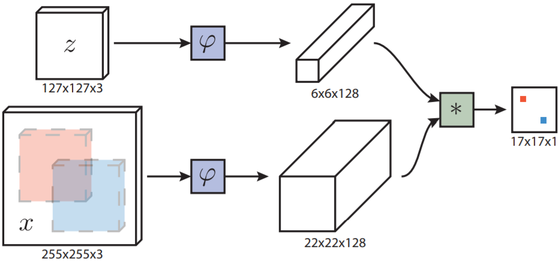
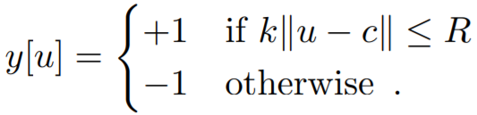
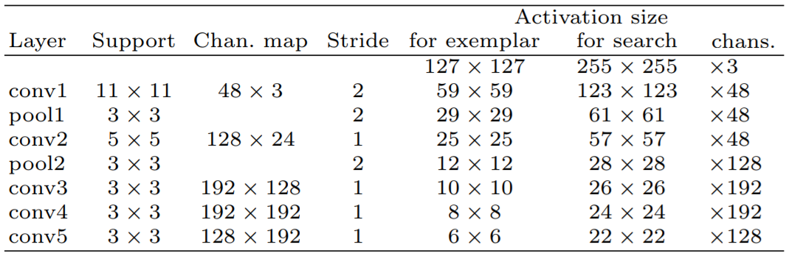

siamese-tracker-road-trip
基于孪生网络的单目标跟踪论文汇总
====

|   Tracker   | Accuracy-VOT2015 |AUC-CVPR2013 | Precision-CVPR2013 | AUC-OTB100 | Precision-OTB100 | AUC-OTB50 | Precision-OTB50 |  FPS  |
| :---------: |        :----------:       |   :----------:      |     :----------------:      |    :--------:    |   :--------------:     |     :-------:      |   :-------------:   | :----: |
|    SINT+    |                 -            |        0.655          |             0.882             |          -          |               -               |         -            |            -             |  4     |
|    SINT     |                  -             |         0.625       |               0.848            |           -         |               -                |          -          |              -           |   4    |
|SiameseFC-ResNet|     0.5527   |           -             |           -                       |         -             |             -                 |          -         |             -           |    25   |
|SiameseFC-AlexNet|     0.5016   |           -             |           -                       |         -             |             -                 |          -         |             -           |    65   |
-------
## Trackers
- **2016_CVPR_SINT**
    * **SINT**:R. Tao, E. Gavves, and A. W. Smeulders. Siamese instance search for tracking. In IEEE Conference on Computer Vision and Pattern Recognition, 2016[[paper](http://openaccess.thecvf.com/content_cvpr_2016/papers/Tao_Siamese_Instance_Search_CVPR_2016_paper.pdf)][[code](https://github.com/taotaoorange/SINT)][[project](https://taotaoorange.github.io/projects/SINT/SINT_proj.html)]  

        ##### Contributions
    	- Propose to learn a ***generic matching function for tracking***, from external video data, to robustly handle the common appearance variations an object can undergo in video sequences.
    	- Present a ***tracker*** based on the learnt generic matching function which reaches state-of-the-art tracking performance.
    	- Design a ***two-stream Siamese network*** specifically for tracking to learn the matching function.

        ##### Pipeline
        

        ##### Candidate Sampling
    	- Use the ***radius sampling strategy*** to generate candidate boxes. At each sample location, generate three scaled versions of the initial box with the scales being {√2/2, 1,√2}

        ##### SINT+
    	- The ***sampling range*** is adaptive to the image resolution, set to be 30/512 ∗ w in this experiment, where w is the image width.
    	- Given the pixels covered by the predicted box in the previous frame and the estimated ***optical flow***, remove the candidate boxes that contain less than 25% of those pixels in the current frame.
-----
- **2016_ECCV_SiameseFC**
    * **SiameseFC:** Luca Bertinetto, Jack Valmadre, João F. Henriques, Andrea Vedaldi, Philip H.S. Torr. "Fully-Convolutional Siamese Networks for Object Tracking." ECCV workshop (2016).[[paper](http://120.52.73.78/arxiv.org/pdf/1606.09549v2.pdf)][[project](http://www.robots.ox.ac.uk/~luca/siamese-fc.html)]
    [[official-code-matlab](https://github.com/bertinetto/siamese-fc)][[code-pytorch](https://github.com/mozhuangb/SiameseFC-pytorch)][[code2-pytorch](https://github.com/GengZ/siameseFC-pytorch-vot)][[code-tensorflow](https://github.com/zzh142857/SiameseFC-tf)]

        ##### Contributions
    	- Achieves ***competitive performance*** in modern tracking benchmarks at speeds that ***far exceed the realtime requirement***.
    	- Present a novel ***Siamese architecture that is fully-convolutional*** with respect to the search image.

        ##### Pipeline
        

        ##### Method
        	- Function h is ***fully-convolutional***:  for integer stride k and any translation .
	- The ***position of the maximum score*** relative to the centre of the score map, multiplied by the ***stride*** of the network, gives the displacement of the target from frame to frame.
	- Train: discriminative approach, Logistic loss: , where v is the real-valued score of a single exemplar-candidate pair and y ∈
{+1, −1} is its ground-truth label.
		Loss for a score map:
		Positive example: within radius R of the centre (accounting for the stride k of the network).
		
	- ***Multiple scales*** are searched in a single forward-pass by assembling a mini-batch of ***scaled images***(scales 1.03^{−1,0,1}), any change in scale is penalized.
	- ***backbone network***: AlexNet.
	
	- ***elementary temporal constraints***: search area(four times its previous size); a cosine window is added to the score map to penalize large displacements.
-----
- **2017_CVPR_CFNet**
- **2017_ICCV_DSiam**
- **2017_Siamese_Survey**
- **2018_CVPR_RASNet**
- **2018_CVPR_SA-Siam**
- **2018_CVPR_SiameseRPN**
- **2018_CVPR_SINT++**
- **2018_ECCV_DaSiamRPN**
- **2018_ECCV_Siam-BM**
- **2018_ECCV_SiamFC-tri**
- **2018_ECCV_StructSiam**
- **2019_CVPR_CIR**
- **2019_CVPR_C-RPN**
- **2019_CVPR_SiamMask**
- **2019_CVPR_SiamRPN++**

## Survey
* **2017**: R. Pflugfelder. An in-depth analysis of visual tracking with siamese neural networks. arXiv:1707.00569, 2017[[paper](https://arxiv.org/pdf/1707.00569.pdf)]  

## TODO  
- [ ] add road trip figure
- [ ] add link for paper&code&project
- [ ] add core analyses
- [ ] add benchmark comparison

## License
MIT
