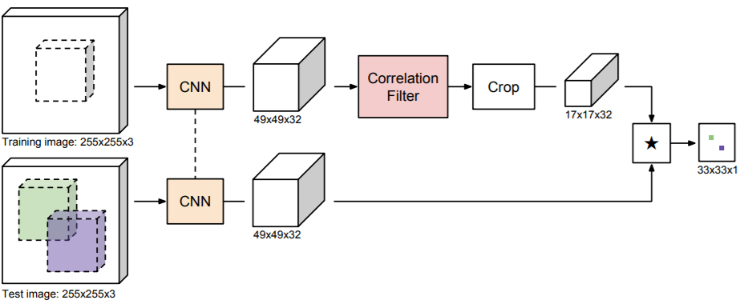
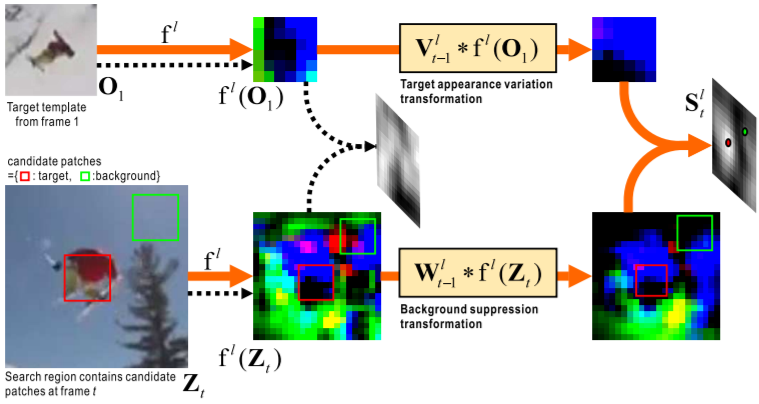
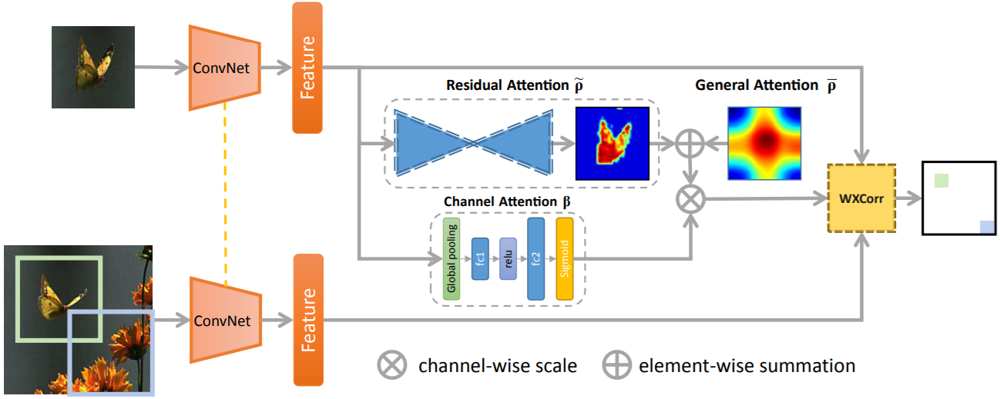
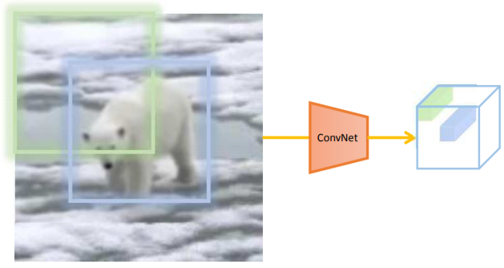
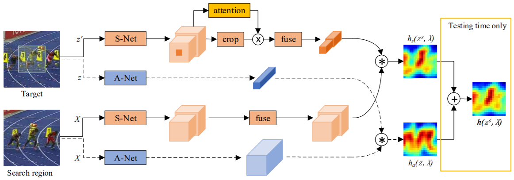
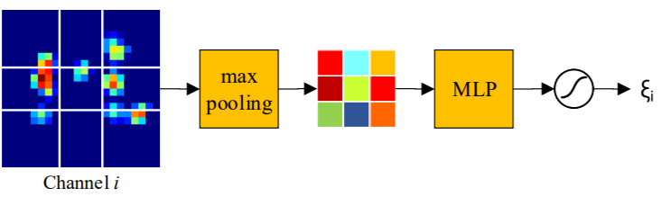

siamese-tracker-road-trip  
基于孪生网络的单目标跟踪论文汇总
====

|   Tracker   | Accuracy-VOT2015 | EAO-VOT2015 | EAO-VOT2017 |AUC-CVPR2013 | Precision-CVPR2013 | AUC-OTB100 | Precision-OTB100 | AUC-OTB50 | Precision-OTB50 |  FPS  |
| :---------: |  :---------: | :---------: |       :----------:       |   :----------:      |     :----------------:      |    :--------:    |   :--------------:     |     :-------:      |   :-------------:   | :----: |
|    SINT+    |                 -            |     -            |    -            |       0.655          |             0.882             |          -          |               -               |         -            |            -             |  4     |
|    SINT     |                  -             |     -            |    -            |        0.625       |               0.848            |           -         |               -                |          -          |              -           |   4    |
|SiameseFC-ResNet|     0.5527   |         -            |    -            |      -             |           -                       |         -             |             -                 |          -         |             -           |    25   |
|SiameseFC-AlexNet|     0.5016   |        -            |    0.2      |       -             |           -                       |         -             |             -                 |          -         |             -           |    65   |
|   CFNet-conv1     |            -       |      -            |    -            |      0.578           |           0.714               |         0.536         |          0.658          |      0.488      |       0.613         |    83   |
|   CFNet-conv2     |            -       |     -            |    -            |       0.611           |           0.746               |         0.568         |          0.693          |      0.530      |       0.660         |    75   |
|   CFNet-conv5     |            -       |      -            |    -            |      0.611           |           0.736               |         0.586         |          0.711          |      0.539      |       0.670         |    43   |
|   DSiam     |         0.5414      |        -            |    -            |    0.642           |           0.860               |         -         |          -          |      -      |       -         |    45   |
|   DSiamM     |           0.5566       |      -            |    -            |      0.656           |           0.891               |         -         |          -          |      -      |       -         |    25   |
|   RASNet     |          -       |      0.327        |    0.281     |      0.670           |           0.892               |        0.642      |          -          |      -      |       -         |    83   |
|   SA-Siam     |         0.59       |       0.31        |     0.236     |      0.676           |           0.894               |        0.656      |        0.864        |      0.610    |       0.823      |    50   |

-------
## Trackers
- **2016_CVPR_SINT**
    * **SINT**:R. Tao, E. Gavves, and A. W. Smeulders. Siamese instance search for tracking. In IEEE Conference on Computer Vision and Pattern Recognition, 2016[[paper](http://openaccess.thecvf.com/content_cvpr_2016/papers/Tao_Siamese_Instance_Search_CVPR_2016_paper.pdf)][[code](https://github.com/taotaoorange/SINT)][[project](https://taotaoorange.github.io/projects/SINT/SINT_proj.html)]  

        ##### Contributions
    	- Propose to learn a ***generic matching function for tracking***, from external video data, to robustly handle the common appearance variations an object can undergo in video sequences.
    	- Present a ***tracker*** based on the learnt generic matching function which reaches state-of-the-art tracking performance.
    	- Design a ***two-stream Siamese network*** specifically for tracking to learn the matching function.

        ##### Pipeline
        

        ##### Candidate Sampling
    	- Use the ***radius sampling strategy*** to generate candidate boxes. At each sample location, generate three scaled versions of the initial box with the scales being {√2/2, 1,√2}
	- Use Euclidean distance as similarity metric.

        ##### SINT+
    	- The ***sampling range*** is adaptive to the image resolution, set to be 30/512 ∗ w in this experiment, where w is the image width.
    	- Given the pixels covered by the predicted box in the previous frame and the estimated ***optical flow***, remove the candidate boxes that contain less than 25% of those pixels in the current frame.
-----
- **2016_ECCV_SiameseFC**
    * **SiameseFC:** Luca Bertinetto, Jack Valmadre, João F. Henriques, Andrea Vedaldi, Philip H.S. Torr. "Fully-Convolutional Siamese Networks for Object Tracking." ECCV workshop (2016).[[paper](http://120.52.73.78/arxiv.org/pdf/1606.09549v2.pdf)][[project](http://www.robots.ox.ac.uk/~luca/siamese-fc.html)]
    [[official-code-matlab](https://github.com/bertinetto/siamese-fc)][[code-pytorch](https://github.com/mozhuangb/SiameseFC-pytorch)][[code2-pytorch](https://github.com/GengZ/siameseFC-pytorch-vot)][[code-tensorflow](https://github.com/zzh142857/SiameseFC-tf)]

        ##### Contributions
    	- Achieves ***competitive performance*** in modern tracking benchmarks at speeds that ***far exceed the realtime requirement***.
    	- Present a novel ***Siamese architecture that is fully-convolutional*** with respect to the search image.

        ##### Pipeline
          

        ##### Method
		- The ***position of the maximum score*** relative to the centre of the score map, multiplied by the ***stride*** of the network, gives the displacement of the target from frame to frame.
		- Function h is ***fully-convolutional*** if:  for integer stride k and any translation .
		- Train: discriminative approach, Logistic loss: , where v is the real-valued score of a single exemplar-candidate pair and y ∈ {+1, −1} is its ground-truth label.  
		- Positive example: within radius R of the centre (accounting for the stride k of the network).
		- Loss for a score map:   
		- ***Multiple scales*** are searched in a single forward-pass by assembling a mini-batch of ***scaled images***(scales 1.03^{−1,0,1}), any change in scale is penalized.
		- ***backbone network***: AlexNet.
		
		- ***elementary temporal constraints***: search area(four times its previous size); a cosine window is added to the score map to penalize large displacements.
-----
- **2017_CVPR_CFNet**
    * **CFNet:** Jack Valmadre, Luca Bertinetto, João F. Henriques, Andrea Vedaldi, Philip H. S. Torr."End-to-end representation learning for Correlation Filter based tracking." CVPR (2017). [[paper](http://openaccess.thecvf.com/content_cvpr_2017/papers/Valmadre_End-To-End_Representation_Learning_CVPR_2017_paper.pdf)][[supp](http://openaccess.thecvf.com/content_cvpr_2017/supplemental/Valmadre_End-To-End_Representation_Learning_2017_CVPR_supplemental.pdf)][[project](http://www.robots.ox.ac.uk/~luca/cfnet.html)][[official-code-matlab](https://github.com/bertinetto/cfnet)]

        ##### Contributions
		- Incorporating the Correlation Filter into the fully-convolutional Siamese framework(SiameseFC).
		- Reveal that adding a Correlation Filter layer does not significantly improve the tracking accuracy.

        ##### Pipeline
          

        ##### Method
		- Establishing an efficient back-propagation map for the solution to a system of circulant equations.
		- Replace  with 
-----
- **2017_ICCV_DSiam**
    * **DSiam:** Qing Guo; Wei Feng; Ce Zhou; Rui Huang; Liang Wan; Song Wang."Learning Dynamic Siamese Network for Visual Object Tracking." ICCV (2017). [[paper](http://openaccess.thecvf.com/content_ICCV_2017/papers/Guo_Learning_Dynamic_Siamese_ICCV_2017_paper.pdf)] [[official-code-matlab](https://github.com/tsingqguo/DSiam)]
        ##### Contributions
		- Propose a fast ***general transformation learning*** model that enables effective online learning of ***target appearance variation*** and ***background suppression*** from previous frames.
		- Propose a ***elementwise multi-layer fusion***, which adaptively integrates the multi-level deep features of DSiam network.
		- Develop a complete ***joint training scheme***, DSiam can be trained as a whole directly on labeled video sequences.

        ##### Pipeline
          
        - Basic pipeline of our DSiam network (orange line) and that of SiamFC(black dashed line).f^l(·) represents a CNN to extract the deep feature at lth layer.  
		- Two transformations are rapidly learned from frame t−1. When the target at frame t (redbox) is entirely different from the template O1, SiamFC gets a meaningless response map, within which no target can be detected

        ##### Method
		
		- Establishing an efficient back-propagation map for the solution to a system of circulant equations.
		- Replace  with 
		-  aims to encourage  being similar to  and is online learned from (t − 1)th frame by considering temporally smooth variation of the target
		-  aims to highlight the deep feature of target neighborhood regions and alleviate the interference of irrelevant background features.
       #####  Elementwise multi-layer fusion
		- Response map for each layer l is , elementwise weight map  and , ***final response map*** , where  denotes the elementwise multiplication.  

        - Two real offline learned fusion weight maps:  
              
			S: response map, layer (l1 = 5, l2=4) from AlexNet. **Note** , the response map of deeper layer l1 has higher weights in periphery and lower weights at central part within the searching region.

------
- **2018_CVPR_RASNet**
    * **RASNet:** Qiang Wang, Zhu Teng, Junliang Xing, Jin Gao, Weiming Hu, Stephen Maybank. "Learning Attentions: Residual Attentional Siamese Network for High Performance Online Visual Tracking." CVPR (2018).[[paper](http://openaccess.thecvf.com/content_cvpr_2018/papers/Wang_Learning_Attentions_Residual_CVPR_2018_paper.pdf)]
        ##### Contributions
		- Different kinds of attention mechanisms are explored within the RASNet: ***General Attention, Residual Attention***, and ***Channel Attention***.
		- Propose an end-to-end deep architecture specifically designed for the object tracking.

        ##### Pipeline
          
        - Weighted cross correlation layer (WXCorr).  
		- Based on the exemplar features, three types of attentions are extracted. Exemplar and search features, along with the attentions as weights are inputed to WXCorr and finally transformed to a response map.

        ##### Method
		- Weighted Cross Correlation: not every constituent provides the same contribution to the cross correlation operation in the Siamese network.the object within the blue rectangular region should be reflected more to the cross correlation operation compared with the green rectangular region.
		
		- Channel Attention: A convolutional ***feature channel*** often corresponds to a certain type of ***visual pattern***.  In certain circumstance some feature channels are more significant than the others.
		- Baseline: SiamFC
		
- **2018_CVPR_SA-Siam**
    * **SA-Siam:** Anfeng He, Chong Luo, Xinmei Tian, Wenjun Zeng. "A Twofold Siamese Network for Real-Time Object Tracking." CVPR (2018).[[paper](http://openaccess.thecvf.com/content_cvpr_2018/papers/He_A_Twofold_Siamese_CVPR_2018_paper.pdf)][[project](https://77695.github.io/SA-Siam/)]
        ##### Contributions
		- SA-Siam is composed of a ***semantic*** branch and an ***appearance*** branch, which are trained separately to keep the heterogeneity of the two types of features.
		- Propose a ***channel attention mechanism*** for the semantic branch. Channel-wise weights are computed according to the channel activations around the target position.

        ##### Pipeline
          
		- The network and data structures connected with ***dotted lines*** are exactly the same as SiamFC.
        - ***A-Net***(blue block) indicates the appearance network, which has exactly the same structure as the SiamFC network.
		- ***S-Net***(origin block) indicates the semantic network. The ***channel attention module*** determines the weight for each feature channel based on both target and context information.

        ##### Method
		- ***Symbols***: **z**(the images of target), **z^s**(target with surrounding context, same size as search region), **X**(search region).
		- ***The appearance branch***: response &space;=&space;corr(f_a(z),&space;f_a(X)))
		- ***The semantic branch***: The S-Net is loaded from a pretrained AlexNet on ImageNet, last two convolution layers(***conv4 and conv5***) are used. The concatenated multilevel features(denoted as ***fs*** ). ***Fusion module***, implemented by 1×1 ConvNet.
		response 
		- ***final response***: , where ***λ*** is the weighting parameter to balance the importance of the two branches, which can be estimated from a validation set.
		- ***Channel Attention in Semantic Branch***:
		Divide the feature map into 3 × 3 grids, ***Max pooling*** is performed within each grid, and then a ***two-layer multilayer perceptron(MLP)*** is used to produce a coefficient for this channel. Finally, a ***Sigmoid function with bias*** is used to generate the final output weight ξi.
		***Note***: this module is passed only once for the first frame of a tracking sequence. The computational overhead is negligible.

- **2018_CVPR_SiameseRPN**
- **2018_CVPR_SINT++**
- **2018_ECCV_DaSiamRPN**
- **2018_ECCV_Siam-BM**
- **2018_ECCV_SiamFC-tri**
- **2018_ECCV_StructSiam**
- **2019_CVPR_CIR**
- **2019_CVPR_C-RPN**
- **2019_CVPR_SiamMask**
- **2019_CVPR_SiamRPN++**

## Survey
* **2017**: R. Pflugfelder. An in-depth analysis of visual tracking with siamese neural networks. arXiv:1707.00569, 2017[[paper](https://arxiv.org/pdf/1707.00569.pdf)]  

## TODO  
- [ ] add road trip figure
- [x] add link for paper&code&project
- [x] add core analyses
- [x] add benchmark comparison
- [ ] finish all paper

## License
MIT
